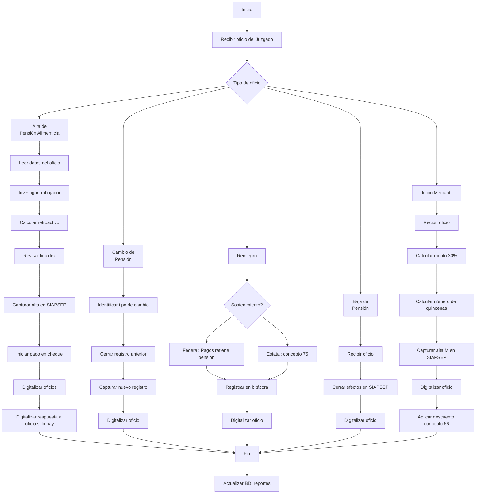

# Diagrama de flujo — Sistema de Pensión Alimenticia y Juicio Mercantil

```mermaid
flowchart TD
    A[Inicio] --> B[Recibir oficio del Juzgado]
    B --> C{Tipo de oficio}

    C --> D[Alta de<br/>Pensión Alimenticia]
    C --> E[Cambio de<br/>Pensión]
    C --> F[Reintegro]
    C --> G[Baja de<br/>Pensión]
    C --> H[Juicio Mercantil]

    %% Alta
    D --> D1[Leer datos del oficio]
    D1 --> D2[Investigar trabajador]
    D2 --> D3[Calcular retroactivo]
    D3 --> D4[Revisar liquidez]
    D4 --> D5[Capturar alta en SIAPSEP]
    D5 --> D6[Iniciar pago en cheque]
    D6 --> D7[Digitalizar oficios]
    D7 --> D8[Digitalizar respuesta a oficio si lo hay]
    D8 --> Z[Fin]

    %% Cambio
    E --> E1[Identificar tipo de cambio]
    E1 --> E2[Cerrar registro anterior]
    E2 --> E3[Capturar nuevo registro]
    E3 --> E4[Digitalizar oficio]
    E4 --> Z

    %% Reintegro
    F --> F1{Sostenimiento?}
    F1 --> F2[Federal: Pagos retiene pensión]
    F1 --> F3[Estatal: concepto 75]
    F2 --> F4[Registrar en bitácora]
    F3 --> F4
    F4 --> F5[Digitalizar oficio]
    F5 --> Z

    %% Baja
    G --> G1[Recibir oficio]
    G1 --> G2[Cerrar efectos en SIAPSEP]
    G2 --> G3[Digitalizar oficio]
    G3 --> Z

    %% Juicio Mercantil
    H --> H1[Recibir oficio]
    H1 --> H2[Calcular monto 30%]
    H2 --> H3[Calcular número de quincenas]
    H3 --> H4[Capturar alta M en SIAPSEP]
    H4 --> H5[Digitalizar oficio]
    H5 --> H6[Aplicar descuento concepto 66]
    H6 --> Z

    Z --> X[Actualizar BD, reportes]
```
