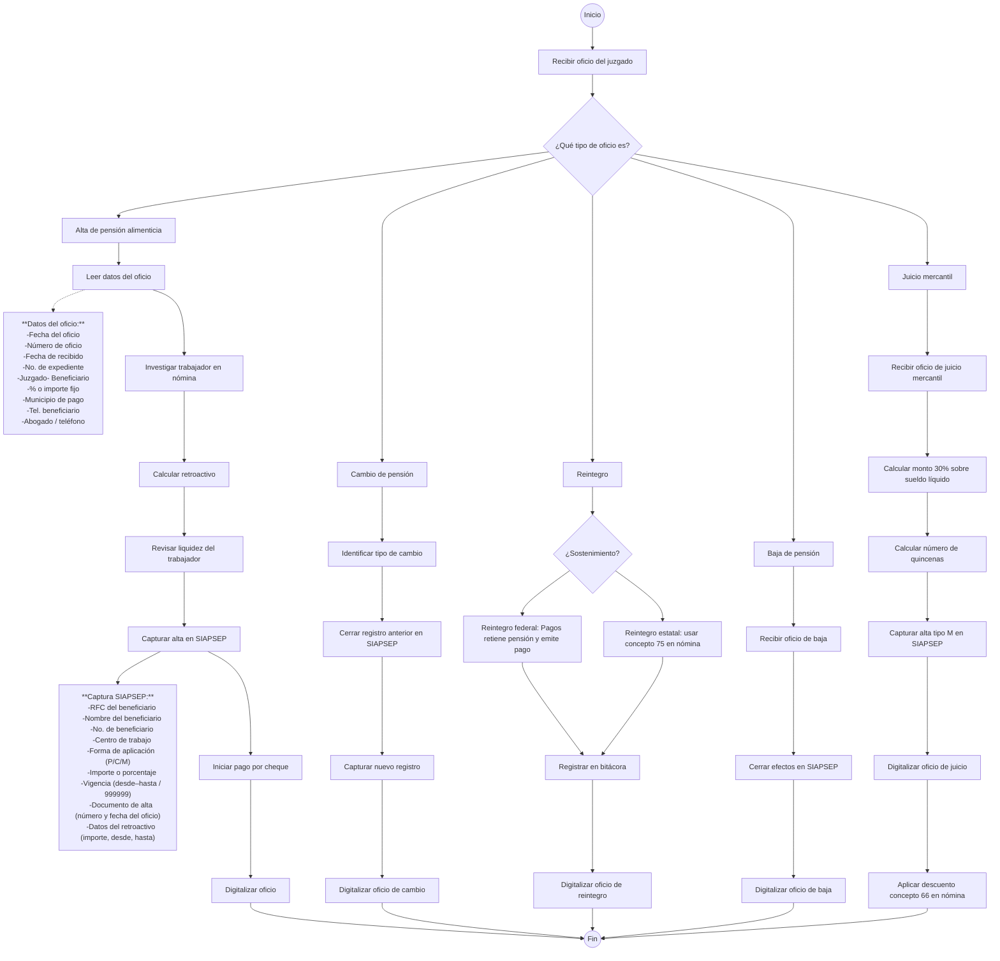

```mermaid
flowchart TB

    %% INICIO
    A(("Inicio")) --> B

    %% OFICIO PRINCIPAL
    B["Recibir oficio del juzgado"] --> C{"¿Qué tipo de oficio es?"}

    C --> D["Alta de pensión alimenticia"]
    C --> E["Cambio de pensión"]
    C --> F["Reintegro"]
    C --> G["Baja de pensión"]
    C --> H["Juicio mercantil"]

    %% RAMA: ALTA
    D --> D1["Leer datos del oficio"]

    %% NOTA LATERAL CON DETALLES DEL OFICIO
    D1 -.-> D1info["**Datos del oficio:**
    -Fecha del oficio
    -Número de oficio
    -Fecha de recibido
    -No. de expediente
    -Juzgado- Beneficiario
    -% o importe fijo
    -Municipio de pago
    -Tel. beneficiario
    -Abogado / teléfono"]

    %% Continúa flujo principal
    D1 --> D2["Investigar trabajador en nómina"]
    D2 --> D3["Calcular retroactivo"]
    D3 --> D4["Revisar liquidez del trabajador"]
    D4 --> D5["Capturar alta en SIAPSEP"]

    %% NOTA LATERAL CON DETALLES PARA SIAPSEP
    D5 --> D5info["**Captura SIAPSEP:**
    -RFC del beneficiario
    -Nombre del beneficiario
    -No. de beneficiario
    -Centro de trabajo
    -Forma de aplicación (P/C/M)
    -Importe o porcentaje
    -Vigencia (desde–hasta / 999999)
    -Documento de alta (número y fecha del oficio)
    -Datos del retroactivo (importe, desde, hasta)"]


    D5 --> D6["Iniciar pago por cheque"]
    D6 --> D7["Digitalizar oficio"]
    D7 --> Z(("Fin"))

    %% -------- RAMA: CAMBIO ----------
    E --> E1["Identificar tipo de cambio"]
    E1 --> E2["Cerrar registro anterior en SIAPSEP"]
    E2 --> E3["Capturar nuevo registro"]
    E3 --> E4["Digitalizar oficio de cambio"]
    E4 --> Z

    %% ------ RAMA: REINTEGRO ---------
    F --> F1{"¿Sostenimiento?"}
    F1 --> F2["Reintegro federal: Pagos retiene pensión y emite pago"]
    F1 --> F3["Reintegro estatal: usar concepto 75 en nómina"]
    F2 --> F4["Registrar en bitácora"]
    F3 --> F4
    F4 --> F5["Digitalizar oficio de reintegro"]
    F5 --> Z

    %% --------- RAMA: BAJA ----------
    G --> G1["Recibir oficio de baja"]
    G1 --> G2["Cerrar efectos en SIAPSEP"]
    G2 --> G3["Digitalizar oficio de baja"]
    G3 --> Z

    %% ---- RAMA: JUICIO MERCANTIL ----
    H --> H1["Recibir oficio de juicio mercantil"]
    H1 --> H2["Calcular monto 30% sobre sueldo líquido"]
    H2 --> H3["Calcular número de quincenas"]
    H3 --> H4["Capturar alta tipo M en SIAPSEP"]
    H4 --> H5["Digitalizar oficio de juicio"]
    H5 --> H6["Aplicar descuento concepto 66 en nómina"]
    H6 --> Z
```